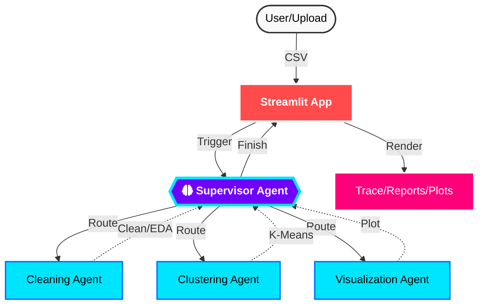

# Agentic Data Engineering: Autonomous Self-Healing Pipelines with LangGraph

Stop building brittle linear scripts. Start architecting deterministic state machines. This repository implements a production-grade, agentic workflow designed to automate complex data cleaning and customer segmentation tasks. Unlike traditional, rigid pipelines, this system leverages a Supervisor-Worker architecture to handle non-deterministic enterprise data with 100% stateful reliability.

# The Principal's Perspective: Why This Matters
In high-stakes enterprise environments—such as those in the UAE’s Financial and Energy sectors—data isn't just "messy"; it's unpredictable. Traditional pipelines fail because they lack reasoning.

This project demonstrates a Self-Healing Data Pipeline. By utilizing a Supervisor Agent (powered by gpt-4o-mini), the system interprets data quality in real-time and "decides" whether to proceed or loop back for deeper cleaning.


## Key Architectural Advantages:

##### Deterministic Reliability: Uses structured system prompts and regex-based parsing to ensure strict routing, preventing "chatty" LLM drift

##### Stateful Session Persistence: Powered by MemorySaver, the graph maintains the complete state of your data across multiple cleaning iterations.

##### Autonomous Hand-off Protocol: Agents are programmed to report "Task Complete" and move the state forward without requiring human intervention for every step.


## Architecture

The workflow is designed as a directed graph where each node represents a specific functional step:

* **Data Loader Node:** Imports CSV/Excel files and initializes the graph state.
* **Cleaning Agent:** Detects anomalies, handles missing values, and prepares features.
* **Segmentation Node:** Applies clustering algorithms or classification logic to group data points.
* **Evaluation Node:** Uses an LLM to interpret the clusters/segments and verify if the cleaning was successful.
* **Router:** Directs the flow based on data quality (e.g., "Back to cleaning" or "Proceed to Final Report").



    
## Component Implementation

#### Supervisor (`agents.py`)
- **LLM:** `gpt-4o-mini`
- **Routing Logic:** Uses a structured system prompt to decide the `next_node` based on the conversation history.
- **Robustness:** Implements Regex-based parsing (`detected_agent`) to handle "chatty" LLM responses, ensuring strict routing even if the LLM wraps the agent name in natural language.
- **Checklist Enforcement:** Explicitly programmed to verify that `Clustering` and `Visualization` have occurred before returning `FINISH`.

### Functional Agents (`agents.py`)
All agents (Cleaning, Clustering, Visualization) are `ReACT` agents built with `create_react_agent`.
- **Context Injection:** The `run_specialist` wrapper injects a specific `SystemMessage` containing the **Absolute Path** of the active CSV file before every invocation.
- **Recursion Management:** Agents operate with a local recursion limit of 50 to prevent infinite loops.
- **Hand-off Protocol:** Agents are instructed to "Finish their turn" and report "Task Complete" rather than asking the user for input, maintaining the autonomous chain.

### Tools (`tools.py`)
- **`clean_data`**:
  - Null Imputation: Median (numeric) / Mode (categorical).
  - Safe Outlier Removal: Uses IQR but guarantees retention of at least 10% of data or 5 rows.
  - Smart Paths: Handles absolute paths and prevents redundant filenames (e.g., `_cleaned_cleaned`).
  - Column Dropping: Accepts a `drop_columns` list to act on EDA findings.
- **`perform_eda`**:
  - Correlation Check: Identifies pairs with >0.85 correlation.
  - Suggestion Engine: Returns a specific list of `SUGGESTED DROPS` to the agent.
- **`perform_clustering`**:
  - Pipeline: `StandardScaler` -> `OneHotEncoder` -> `KMeans` -> `PCA` (2 components).
  - Output: Saves `_clustered.csv`.
- **`generate_visualization`**:
  - Validation: Checks for PCA columns.
  - Signalling: Returns a success message that triggers the Streamlit UI to render the chart.

#### State Management (`state.py`)
- **`AgentState`**: A TypedDict tracking:
  - `messages`: List of `BaseMessage` (User/AI/Tool).
  - `next_node`: The next agent to call.
  - `df_path`: The **Absolute Path** to the currently active CSV file.

### Persistence (`agents.py`)
- **`MemorySaver`**: Uses in-memory checkpointing to maintain graph state across steps within a single session.

### User Interface (`app.py`)
- **Streaming Trace:** Uses `trace_placeholder` to render real-time tool calls and arguments.
- **Agent Reports:** Filters the main chat stream to display nicely formatted Markdown reports (e.g., `### 🧹 Cleaning Report`) from agent summaries.
- **Dynamic File Handling:** 
  - Uses `os.path.abspath` for all file saves.
  - Updates `st.session_state.df_path` based on agent outputs.
- **Visualization:**
  - Detects `_clustered.csv` to render PCA scatter plots.
  - Detects `signals generated` to render EDA heatmaps.
- **Export:** Provides a `st.download_button` for the final processed dataset.

#### Setup & Installation
#### Prerequisites
- Python 3.10+
- `uv` package manager (recommended)
- OpenAI API Key


## Installation

1. **Clone the repository:**
```bash
git clone https://github.com/premkumarkora/LangGraph_Cleaning_segmentation.git
cd LangGraph_Cleaning_segmentation

```


2. **Create a virtual environment:**
```bash
python -m venv venv
source venv/bin/activate  # On Windows: venv\Scripts\activate

```


3. **Install dependencies:**
```bash
pip install -r requirements.txt

```


## Configuration

Create a `.env` file in the root directory and add your API keys (if using LLMs like OpenAI or Anthropic for analysis):

```env
OPENAI_API_KEY=your_api_key_here
# Optional: LANGCHAIN_TRACING_V2=true for debugging

```

## 💻 Usage

Run the main pipeline script to process your data:

```python
from langgraph_pipeline import run_pipeline

# Provide path to your dataset
results = run_pipeline("data/raw_data.csv")

# Access cleaned data and segmentation labels
print(results["cleaned_data"])
print(results["segments"])

```

## Project Structure

```text
├── data/                   # Sample datasets
├── agents/                 # Logic for cleaning and segmentation agents
│   ├── cleaner.py          # Data preprocessing functions
│   └── segmenter.py        # ML clustering/segmentation logic
├── graph.py                # LangGraph StateGraph definition
├── main.py                 # Entry point for the application
├── requirements.txt        # Dependencies (pandas, scikit-learn, langgraph, etc.)
└── README.md

```

## Key Features

* **State Persistence:** The graph maintains the state of the data across multiple cleaning iterations.
* **Conditional Logic:** Dynamically decides whether to scale features or encode categorical variables based on data profiling.
* **Human-in-the-Loop:** (Optional) Ability to pause the graph for human approval before final segmentation.
* **Extensible:** Easily add new "nodes" for specific domain-based cleaning rules.

## Contributing

Contributions are welcome! If you have suggestions for better segmentation techniques or cleaning heuristics:

1. Fork the Project
2. Create your Feature Branch (`git checkout -b feature/AmazingFeature`)
3. Commit your Changes (`git commit -m 'Add some AmazingFeature'`)
4. Push to the Branch (`git push origin feature/AmazingFeature`)
5. Open a Pull Request

## License

Distributed under the MIT License. See `LICENSE` for more information.

---

**Author:** [Prem Kumar Kora](https://www.google.com/search?q=https://github.com/premkumarkora)
