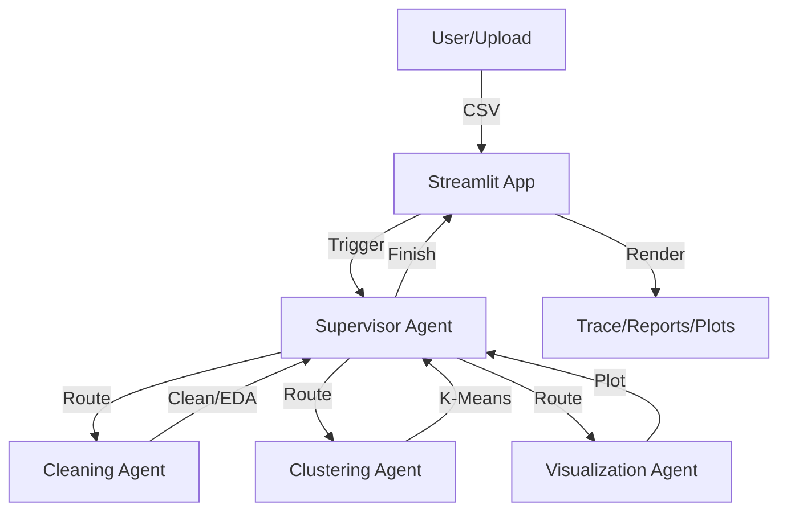

# Technical Documentation: Autonomous AI Data Analytics Application

## 1. System Architecture
The application follows a **Multi-Agent Supervisor Architecture** powered by `LangGraph` and `LangChain`. It is hosted on a `Streamlit` frontend which manages the session state and visualization rendering.

### 1.1 High-Level Flow


## 2. Component Implementation

### 2.1 Supervisor (`agents.py`)
- **LLM:** `gpt-4o-mini`
- **Routing Logic:** Uses a structured system prompt to decide the `next_node` based on the conversation history.
- **Robustness:** Implements Regex-based parsing (`detected_agent`) to handle "chatty" LLM responses, ensuring strict routing even if the LLM wraps the agent name in natural language.
- **Checklist Enforcement:** Explicitly programmed to verify that `Clustering` and `Visualization` have occurred before returning `FINISH`.

### 2.2 Functional Agents (`agents.py`)
All agents (Cleaning, Clustering, Visualization) are `ReACT` agents built with `create_react_agent`.
- **Context Injection:** The `run_specialist` wrapper injects a specific `SystemMessage` containing the **Absolute Path** of the active CSV file before every invocation.
- **Recursion Management:** Agents operate with a local recursion limit of 50 to prevent infinite loops.
- **Hand-off Protocol:** Agents are instructed to "Finish their turn" and report "Task Complete" rather than asking the user for input, maintaining the autonomous chain.

### 2.3 Tools (`tools.py`)
- **`clean_data`**:
  - Null Imputation: Median (numeric) / Mode (categorical).
  - Safe Outlier Removal: Uses IQR but guarantees retention of at least 10% of data or 5 rows.
  - Smart Paths: Handles absolute paths and prevents redundant filenames (e.g., `_cleaned_cleaned`).
  - Column Dropping: Accepts a `drop_columns` list to act on EDA findings.
- **`perform_eda`**:
  - Correlation Check: Identifies pairs with >0.85 correlation.
  - Suggestion Engine: Returns a specific list of `SUGGESTED DROPS` to the agent.
- **`perform_clustering`**:
  - Pipeline: `StandardScaler` -> `OneHotEncoder` -> `KMeans` -> `PCA` (2 components).
  - Output: Saves `_clustered.csv`.
- **`generate_visualization`**:
  - Validation: Checks for PCA columns.
  - Signalling: Returns a success message that triggers the Streamlit UI to render the chart.

### 2.4 State Management (`state.py`)
- **`AgentState`**: A TypedDict tracking:
  - `messages`: List of `BaseMessage` (User/AI/Tool).
  - `next_node`: The next agent to call.
  - `df_path`: The **Absolute Path** to the currently active CSV file.

### 2.5 Persistence (`agents.py`)
- **`MemorySaver`**: Uses in-memory checkpointing to maintain graph state across steps within a single session.

## 3. User Interface (`app.py`)
- **Streaming Trace:** Uses `trace_placeholder` to render real-time tool calls and arguments.
- **Agent Reports:** Filters the main chat stream to display nicely formatted Markdown reports (e.g., `### 🧹 Cleaning Report`) from agent summaries.
- **Dynamic File Handling:** 
  - Uses `os.path.abspath` for all file saves.
  - Updates `st.session_state.df_path` based on agent outputs.
- **Visualization:**
  - Detects `_clustered.csv` to render PCA scatter plots.
  - Detects `signals generated` to render EDA heatmaps.
- **Export:** Provides a `st.download_button` for the final processed dataset.

## 4. Setup & Installation
### Prerequisites
- Python 3.10+
- `uv` package manager (recommended)
- OpenAI API Key

### Installation
```bash
# Install dependencies
uv pip install -r requirements.txt
# OR manual install
pip install streamlit langchain langgraph pandas plotly scikit-learn python-dotenv langchain-openai
```

### Running the App
```bash
# Create .env file with OPENAI_API_KEY
uv run streamlit run app.py
```

## 5. Troubleshooting
- **RecursionError:** The graph is configured with `recursion_limit=100`. If hit, restart the app or simplify the data.
- **"File not found":** All internal logic uses absolute paths (`/users/.../temp_data/file.csv`). Ensure the app has write permissions to the `temp_data` folder.
- **Empty Dataset:** The cleaning tool has guardrails. If data is still empty, the source file may be fully corrupt or contain only nulls.
